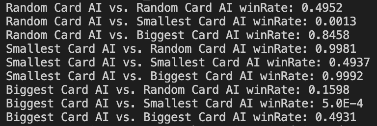

# AI-Card-Conundrum
Algorithm for Best Strategy in an UnoWar Style Card Game!

## Check Out the WinRates Below!



## <a href="https://www.youtube.com/watch?v=UNz9k9E9IWM"> Demo Video on YouTube </a>

## Setup

If you want to play around with the algorithms, feel free to clone my repo. To start, please enter the following commands on your terminal:

```
git clone https://github.com/CamNagle24/AI-Card-Conundrum
```

You can then go to the file in src -> student -> Tournament.java 
Then run that to see all the win rates for 10000 trials of each AI strategy.